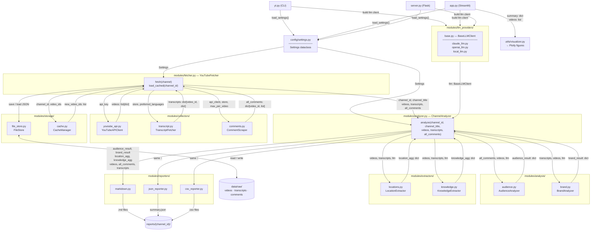

# YouTube Channel Analysis Tool

Fetch transcripts and comments from a YouTube channel, then use an LLM (Claude / OpenAI / Ollama) to analyse audience profiles, brand positioning, and build a location/knowledge database. Includes both a Streamlit interface and a Flask-based web UI for interactive use.

## Features

| Feature | Description |
|---------|-------------|
| Audience profile analysis | Infer audience age, interests, pain points, and language patterns from comments |
| Brand positioning analysis | Extract content themes, communication style, and value propositions from transcripts |
| Knowledge index | Organise knowledge and tips per episode with video links for direct reference |
| Location/food/equipment DB | Structured extraction of places, food, and gear mentioned in videos |
| Incremental updates | Auto-detect new videos, fetch only new data, preserve historical analysis snapshots |
| Web UI (Flask) | Simple HTML interface with real-time progress streaming |
| Multi-LLM support | Plug in Claude, OpenAI GPT, or any local Ollama model |

---

## Quick Start

### 1. Install dependencies

```bash
pip install -r requirements.txt
```

**Required packages:**
- `yt-dlp` - YouTube video/transcript downloader
- `youtube-transcript-api` - Transcript fetcher
- `anthropic` - Claude API client
- `openai` - OpenAI API client
- `flask` - Flask web server
- `requests` - HTTP library for API calls
- `python-dotenv` - Environment variable management

### 2. Configure API keys

```bash
cp .env.example .env
# Edit .env — fill in YOUTUBE_API_KEY plus at least one LLM key
```

**How to get API keys:**
- YouTube Data API v3: [Google Cloud Console](https://console.cloud.google.com/apis/credentials) → Enable YouTube Data API v3
- Anthropic API: [console.anthropic.com](https://console.anthropic.com/)
- OpenAI API: [platform.openai.com](https://platform.openai.com/)

### 3. (Optional) Install Ollama for local LLM

If you want to use local models instead of cloud APIs:

1. Download and install Ollama from [ollama.com](https://ollama.com)
2. Pull a model:
   ```bash
   ollama pull gemma3:12b
   # or
   ollama pull llama3.1
   ```
3. Update `.env`:
   ```
   LOCAL_LLM_MODEL=gemma3:12b
   OLLAMA_CONTEXT_LENGTH=8192
   ```

### 4a. Web UI (Flask) — Recommended

**Windows:**
Double-click `start.bat` to launch the tool. The browser will automatically open to `http://localhost:5000`.

**Note:** `start.bat` will automatically:
- Check if Ollama is running (if using local LLM)
- Start the Flask server
- Open your browser

### 4b. CLI

```bash
# Fetch data + analyse in one step
python yt.py run --channel @ChannelHandle

# Or separately:
python yt.py fetch   --channel @ChannelHandle        # download only
python yt.py analyze --channel-id UCxxxxxxxxxx       # analyse cached data (no YouTube API)
```

---

## Web UI Usage (Flask)

1. **Launch the application:**
   - Windows: Double-click `start.bat`
   - Mac/Linux: Run `./start.sh` or `python server.py`

2. **Configure analysis:**
   - Enter YouTube channel handle (e.g., `@ChannelName`) or channel ID
   - Select LLM backend: Claude, OpenAI, or Local (Ollama)
   - If using Local, select an installed model from the dropdown
   - Set maximum number of videos to analyze
   - Optional: Skip certain analysis types to speed up processing

3. **Run analysis:**
   - Click "開始分析" (Start Analysis)
   - Watch real-time progress in the terminal output
   - Results will appear automatically when complete

4. **View results:**
   - Statistics summary (videos, comments, knowledge items, locations)
   - Audience analysis insights
   - Brand positioning analysis
   - Knowledge index with searchable table
   - All results are also saved to `reports/{channel_id}/`

---

## CLI Commands

### `fetch` — Download data from YouTube

```bash
python yt.py fetch --channel @ChannelHandle
python yt.py fetch --channel UCxxxxxxxxxx --max-videos 50
```

Fetches the video list, transcripts, and comments into the local cache. Requires `YOUTUBE_API_KEY`.

### `analyze` — Analyse cached data (no YouTube API needed)

```bash
# Audience + brand only (fastest)
python yt.py analyze --channel-id UCxxxxxxxxxx --llm local --skip-extraction

# Full analysis with Claude
python yt.py analyze --channel-id UCxxxxxxxxxx --llm claude

# Local model, limited videos
python yt.py analyze --channel-id UCxxxxxxxxxx --llm local --model gemma3:12b --max-videos 20

# OpenAI GPT-4o
python yt.py analyze --channel-id UCxxxxxxxxxx --llm openai
```

| Flag | Description | Default |
|------|-------------|---------|
| `--channel-id` | Channel ID from the `data/` directory (required) | — |
| `--llm` | LLM backend: `claude`, `openai`, or `local` (Ollama) | from `.env` |
| `--model` | Model name override | from `.env` |
| `--ollama-url` | Ollama base URL | from `.env` |
| `--data-dir` | Data directory | `DATA_DIR` from `.env` or `./data` |
| `--output-dir` | Report output directory | `REPORTS_DIR` from `.env` or `./reports` |
| `--skip-audience` | Skip audience analysis | `false` |
| `--skip-brand` | Skip brand analysis | `false` |
| `--skip-extraction` | Skip location/knowledge extraction | `false` |
| `--max-videos` | Limit number of videos analysed | all |

### `run` — Fetch + analyse in one step

```bash
python yt.py run --channel @ChannelHandle
python yt.py run --channel @ChannelHandle --llm local --skip-extraction
```

Accepts all the same flags as `analyze`. Requires `YOUTUBE_API_KEY`.

---

## `.env` configuration

| Variable | Description | Default |
|----------|-------------|---------|
| `YOUTUBE_API_KEY` | YouTube Data API v3 key (required for `fetch` / `run`) | — |
| `ANTHROPIC_API_KEY` | Anthropic API key (required when `LLM_BACKEND=claude`) | — |
| `OPENAI_API_KEY` | OpenAI API key (required when `LLM_BACKEND=openai`) | — |
| `LLM_BACKEND` | `claude`, `openai`, or `local` (Ollama) | `claude` |
| `CLAUDE_MODEL` | Claude model name | `claude-sonnet-4-6` |
| `OPENAI_MODEL` | OpenAI model name | `gpt-4o` |
| `LOCAL_LLM_MODEL` | Ollama model name | `qwen2.5:latest` |
| `LOCAL_LLM_URL` | Ollama API base URL | `http://localhost:11434/v1` |
| `OLLAMA_CONTEXT_LENGTH` | Context window size for Ollama models | `4096` |
| `MAX_VIDEOS` | Maximum videos to fetch | `20` |
| `MAX_COMMENTS_PER_VIDEO` | Maximum comments per video | `100` |
| `TRANSCRIPT_LANGUAGES` | Language priority (comma-separated) | `ja,zh-Hant,zh-Hans,en` |
| `DATA_DIR` | Raw data cache directory | `./data` |
| `REPORTS_DIR` | Report output directory | `./reports` |

CLI flags (`--llm`, `--model`, `--ollama-url`) override `.env` values when provided.

**Recommended settings for local LLM:**
```
LOCAL_LLM_MODEL=gemma3:12b
OLLAMA_CONTEXT_LENGTH=8192
```

---

## Output

### Report files

```
reports/{channel_id}/
├── audience_report.md       # Audience profile
├── brand_report.md          # Brand positioning
├── comments.csv             # Raw comments export
├── transcripts.csv          # Raw transcripts export
├── summary.json             # Aggregated stats + analysis history
│
│   # Generated unless --skip-extraction is set:
├── knowledge_index.md
├── knowledge_index.csv
├── locations_database.json
├── locations_database.csv
├── food_database.csv
└── equipment_database.csv
```

### Raw data cache

```
data/raw/
├── videos/{channel_id}/video_list.json
├── transcripts/{channel_id}/{video_id}.json
└── comments/{channel_id}/{video_id}.json
```

Cached data is reused on subsequent runs — only new videos trigger API calls.

---

## Incremental updates

Re-run `fetch` or `run` at any time:

```bash
python yt.py fetch --channel @ChannelHandle
```

- Already-fetched videos are read from cache — no redundant API calls
- Only new videos have their transcripts and comments fetched
- Each run appends a snapshot to `summary.json`'s `analysis_history`

---

## Troubleshooting

### Chinese characters appear as gibberish in terminal

The `start.bat` includes `chcp 65001` to set UTF-8 encoding. If you still see encoding issues, ensure your terminal font supports Chinese characters.

### Ollama model warnings

If you see warnings like `bad manifest filepath`, these models are corrupted or partially downloaded. Fix by:

```bash
# Re-download the model
ollama pull model-name

# Or remove if not needed
ollama rm model-name
```

### Prompt truncation warnings

If you see `truncating input prompt limit=4096`, your transcripts exceed the model's context window. Solutions:

1. Increase context length in `.env`:
   ```
   OLLAMA_CONTEXT_LENGTH=8192
   ```
2. Use a model with larger context window
3. Enable `--skip-extraction` to reduce prompt size

### Model dropdown shows "無可用模型"

1. Ensure Ollama is installed and running
2. Pull at least one model: `ollama pull gemma3:12b`
3. Restart the Flask server

### Browser doesn't auto-open

Manually navigate to `http://localhost:5000` after running `start.bat` or `python server.py`.

---

## Project structure

```
├── app.py                        # Streamlit web interface
├── server.py                     # Flask web server (NEW)
├── index.html                    # Flask web UI frontend (NEW)
├── start.bat                     # Windows launcher script (NEW)
├── start.sh                      # Mac/Linux launcher script (NEW)
├── yt.py                         # CLI entry point (fetch / analyze / run)
├── modules/
│   ├── fetcher.py                # High-level fetch orchestration
│   ├── analyzer.py               # High-level analysis orchestration
│   ├── llm_providers/
│   │   ├── base.py               # BaseLLMClient interface
│   │   ├── claude_llm.py         # Anthropic Claude
│   │   ├── openai_llm.py         # OpenAI GPT
│   │   └── local_llm.py          # Ollama (local)
│   ├── collectors/               # YouTube data collection
│   │   ├── youtube_api.py        # YouTube Data API client
│   │   ├── transcript.py         # Transcript fetcher (yt-dlp + fallback)
│   │   └── comments.py           # Comment scraper
│   ├── storage/                  # Local cache management
│   │   ├── file_store.py         # JSON / CSV read-write
│   │   └── cache.py              # Cache freshness checks
│   ├── analysis/                 # LLM-based analysis
│   │   ├── audience.py           # Audience profile analyzer
│   │   └── brand.py              # Brand positioning analyzer
│   ├── extractors/               # Structured data extraction
│   │   ├── locations.py          # Location / food / equipment extractor
│   │   └── knowledge.py          # Knowledge index extractor
│   └── reporters/                # Output formatting
│       ├── markdown.py           # Markdown report writer
│       ├── json_reporter.py      # summary.json writer
│       └── csv_reporter.py       # CSV export writer
├── utils/
│   └── visualizer.py             # Plotly chart helpers for Streamlit
└── config/
    └── settings.py               # Settings dataclass + .env loader
```

### Data flow diagram



### Adding a new LLM provider

Create `modules/llm_providers/my_llm.py`, subclass `BaseLLMClient`, implement `analyze()`, and pass it to `ChannelAnalyzer` or select it via `--llm` in the CLI.

### Adding a new analysis type

Create a new file in `modules/analysis/` or `modules/extractors/`, then call it from `modules/analyzer.py`'s `ChannelAnalyzer.analyze()`.

---

## New Features in This Version

### Flask Web Interface
- Clean, simple HTML interface
- Real-time progress streaming via Server-Sent Events (SSE)
- Dynamic Ollama model selection (loads from your installed models)
- One-click launch via `start.bat` (Windows) or `start.sh` (Mac/Linux)

### Automatic Ollama Detection
The `start.bat` script automatically checks if Ollama is running and starts it if needed (Windows only).

### Enhanced Error Handling
- Better error messages in the web UI
- Progress logs visible in real-time
- Graceful handling of missing models or API keys